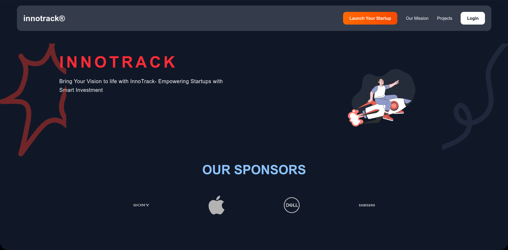

# Innotrack



> **Innotrack** is the official startup‑incubator platform for **ESTIN College**. It lets students pitch entrepreneurial ideas and, once accepted, manage their project milestones while administrators track progress in real time.

## Table of Contents

* [About the Project](#about-the-project)
* [Features](#features)
* [Tech Stack](#tech-stack)
* [Getting Started](#getting-started)
* [Project Structure](#project-structure)
* [Roadmap](#roadmap)
* [Contact](#contact)

---

## About the Project

Innotrack was born to solve a simple problem: **how can ESTIN’s incubator keep dozens of student startups organized and moving forward?**  The platform provides a single hub where innovators submit proposals, mentors collaborate, and admins oversee KPIs without drowning in spreadsheets.

> **Mission**  Empower every ESTIN student with the tools and mentorship they need to transform ideas into ventures.

This README focuses on the **frontend** side of the project, which was built using **Next.js**.

---

## Features (Frontend)

### 💡 Students

* **Pitch ideas** via a dynamic proposal submission form.
* **Realtime feedback** & status updates via clean UI state changes.
* **Milestone board** with a drag‑and‑drop Kanban interface.
* **Progress charts** rendered with charting libraries.

### 🛡️ Administrators

* **Moderate proposals** with a scoring interface.
* **Dashboard** overview of all teams and their progress.
* **Send announcements** via modals or broadcast cards.

### 🌐 General

* Fully responsive layout (mobile‑first)
* Role-based conditional rendering (Student / Admin)
* Smooth routing using Next.js App Router
* Modern UI with reusable components and utility‑first CSS (Tailwind CSS)

---

## Tech Stack (Frontend)

| Layer      | Technology              | Description                              |
| ---------- | ----------------------- | ---------------------------------------- |
| Framework  | **Next.js 14**          | React framework with SSR & App Router    |
| Styling    | **Tailwind CSS**        | Utility-first CSS for fast styling       |
| State Mgmt | **React Context API**   | Lightweight global state management      |
| Charts     | **Recharts / Chart.js** | For analytics and progress visualization |
| Forms      | **React Hook Form**     | Declarative form handling + validation   |

---

## Getting Started (Frontend)

### Prerequisites

* **Node ≥ 20**
* **npm** (or npm/yarn)

### Installation

```bash
# 1. Clone the repo
$ git clone https://github.com/fratsaislam/Innotrack-front
$ cd Innotrack-front


# 3. Install dependencies
$ npm install

# 4. Start the development server
$ npm run dev
```

Visit **[http://localhost:3000](http://localhost:3000)** to view the app.

---

## Project Structure (Frontend)

```
frontend/
└── public/           # Static files like images
├── app/              # Next.js app directory (routing, layouts)
    ├──components/       # Reusable UI components
```

---

## Roadmap

* [ ] Improve accessibility (ARIA roles, keyboard navigation)
* [ ] Integrate i18n (Arabic / French / English)
* [ ] Dark mode support
* [ ] Add animations with Framer Motion

---

## Contact

* **Frontend Lead** – (i_fratsa@estin.dz)

Made with ❤️ at **ESTIN**.
